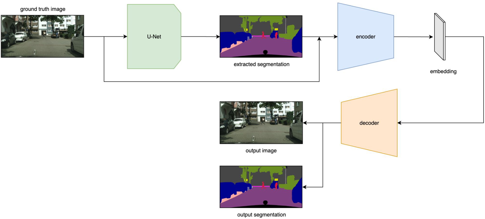

# TransmissionAutoEncoder

This architecture is composed by a ResNet followed from an Autoencoder. The objective is to compress both information and send through a mobile network the embedding of the image itself and its segmentation. There is also a parameter to choose the size of embeddings to simulate the network bottleneck

<p float="left" align="center">
  
</p>


# Usage
## Install
```
conda create --name autoenc --file requirements.txt
```

## Example script for an image
```
python3 example.py
```

## Train

1. Download the dataset from [here](https://www.cityscapes-dataset.com/downloads/) (free registration needed). I reccomend to use `leftImg8bit_trainvaltest.zip` `gtFine_trainvaltest.zip`.
2. Run `python3 train.py`

